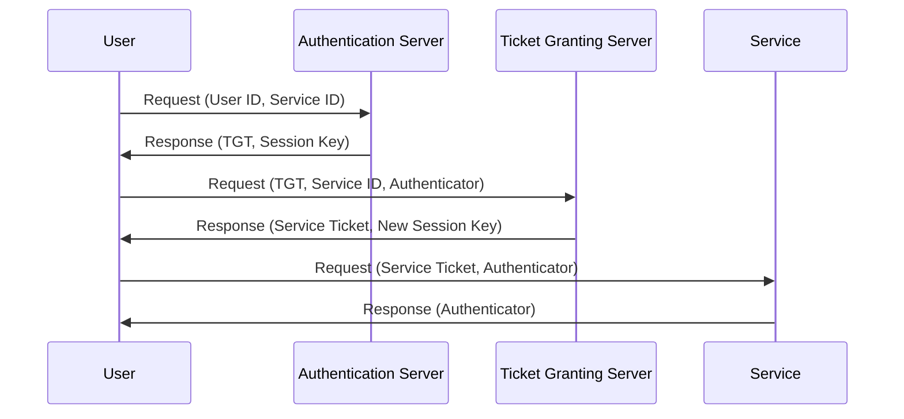
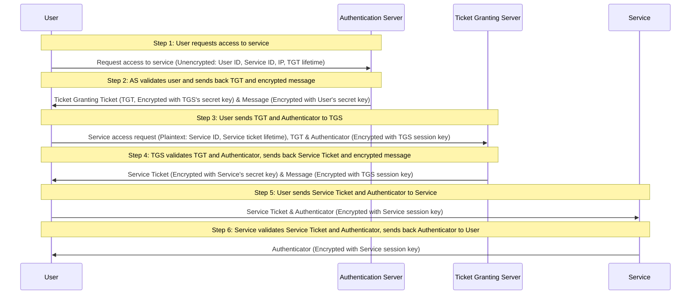

Based on the provided transcript, here is a detailed summary of the Kerberos Authentication Protocol steps:

1. **User Logs In**: The user enters their credentials (username and password) on their client machine.

2. **Authentication Service Request**: The client sends an unencrypted message to the Authentication Server (AS) containing the user's ID, the requested service's ID, the user's IP address, and the requested lifetime of the Ticket Granting Ticket (TGT).

3. **Authentication Server Response**: The AS validates the user's ID, generates a TGT, and a session key for communication with the Ticket Granting Server (TGS). The TGT is encrypted with the TGS's secret key, and the session key is encrypted with the user's secret key (derived from their password).

4. **Client Decrypts Session Key**: The client uses the user's secret key to decrypt the session key from the AS's response.

5. **Ticket Granting Service Request**: The client sends a new message to the TGS, including the encrypted TGT, a service ID for the desired service, and an Authenticator (which includes the user's ID and timestamp), encrypted with the TGS session key.

6. **Ticket Granting Server Response**: The TGS decrypts the TGT and the Authenticator, validates the requests, and if successful, issues a service ticket encrypted with the service's secret key and a new session key for the client to use with the service.

7. **Client Decrypts Service Session Key**: The client decrypts the new session key from the TGS's response using the TGS session key.

8. **Service Request**: The client sends the service ticket and a new Authenticator (encrypted with the service session key) to the service.

9. **Service Validates Ticket and Authenticator**: The service decrypts the service ticket with its secret key, extracts the session key, and uses it to decrypt the Authenticator. The service then validates the Authenticator and the service ticket.

10. **Service Grants Access**: If the validation is successful, the service sends back an Authenticator message to the client, proving its identity and completing mutual authentication. The client and service can now communicate securely using the session key.

Here is a Mermaid JS diagram representing the Kerberos Authentication Protocol:

This diagram shows the sequence of messages exchanged between the user, the authentication server, the ticket granting server, and the service during the Kerberos authentication process.

Here's an ultra-detailed Mermaid JS diagram that explains the Kerberos Authentication Protocol based on the provided transcript:

This diagram represents the sequence of messages exchanged between the User (U), Authentication Server (AS), Ticket Granting Server (TGS), and the Service (S) during the Kerberos authentication process. Each step involves the exchange of encrypted and unencrypted messages to ensure secure authentication without directly exchanging passwords or encryption keys over the network.

