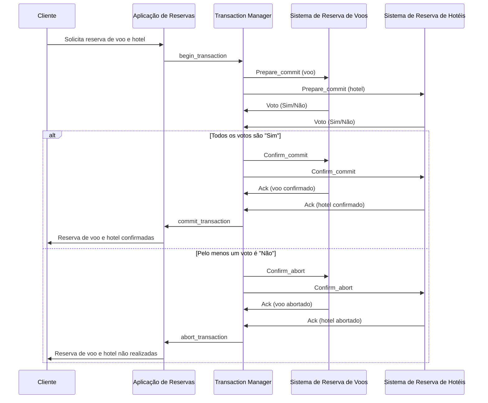

Pagina 12
1. Qual é o problema que as transações procuram resolver?
2. Quais são as falhas que podem ser resolvidas com transações?
3. O que significa cada uma das propriedades ACID das transações?
4. Porque é que as transações têm que ter um mecanismo de sincronização associado?
5. Qual é o papel do diário (“Log”) nas transações?

Pagina 18
1. Quais são os problemas adicionais que se colocam em transações distribuídas?
2. Qual é a função de cada um dos componentes de um sistema transacional distribuído: Aplicação, Transaction Monitor, Resource Monitor?

Pagina 27
1. Quando é que é executado o protocolo 2-Phase Commit (2PC)? Dê um exemplo com uma aplicação de reservas que pretende reservar um voo e um hotel de forma transacional (ou faz ambas as reservas, ou não faz nenhuma delas).
2. Como é o funcionamento do protocolo 2-Phase Commit (2PC) se não existirem falhas?
3. O que é que o Coordenador deve fazer se não conseguir receber resposta de um participante à mensagem “Prepare_commit”? E se for à mensagem “Confirm_commit”? E se for à mensagem “Confirm_abort”?
4. O que é que um participante deve fazer se não receber do coordenador a mensagem “Prepare_commit”? E se for a mensagem “Confirm_abort”? E se for a mensagem “Confirm_commit”?
5. O que é que o Coordenador deve fazer se falhar, e ao recuperar verificar que está no estado “Esperar” (ainda não recebeu todos os votos)? E se verificar que está no estado “Confirmar”?
6. O que é que um Participante deve fazer se falhar, e ao recuperar verificar que está no estado “Preparado”, pois votou “Commit” mas ainda não recebeu a mensagem de confirmação do Coordenador?

--- 

Summary: 

O Capítulo 9 aborda transações em sistemas distribuídos, focando-se em garantir a atomicidade, consistência, isolamento e durabilidade (propriedades ACID) das operações, mesmo em presença de falhas. As transações atômicas são apresentadas como conjuntos de operações que devem ser executadas integralmente ou não serem executadas de todo, com mecanismos de recuperação para reverter operações parciais em caso de falhas.

O problema ilustrado é o de uma transferência bancária entre duas contas, onde uma falha após o levantamento e antes do depósito pode levar a inconsistências. Para resolver isso, são introduzidos conceitos como o início e término de transações (begin_transaction, commit_transaction, abort_transaction), leitura e escrita de dados (Read, Write), e o uso de diários (logs) para manter o estado das transações.

A sincronização é essencial para manter a ordem correta das operações e evitar conflitos, sendo implementada através de mecanismos como o bloqueio em duas fases (two-phase locking) e a prevenção ou detecção de deadlocks.

Em ambientes distribuídos, as transações envolvem a coordenação entre componentes independentes, como o Transaction Manager (TM) e os Resource Managers (RMs), que gerenciam os dados. O protocolo Two-Phase Commit (2PC) é detalhado como um método para garantir que todas as partes concordem com o resultado da transação, com duas fases distintas: preparação e confirmação/abortamento.

O 2PC é bloqueante e pode levar a bloqueios se um coordenador falhar, mas é necessário para garantir a atomicidade e consistência em sistemas distribuídos. Em caso de falhas, o protocolo inclui estratégias para recuperação e continuação das transações.

O capítulo conclui com a importância de entender os problemas que as transações resolvem, as falhas que podem ser tratadas, o significado das propriedades ACID, a necessidade de mecanismos de sincronização e o papel dos diários em transações, especialmente em contextos distribuídos.

--- 

O capítulo 9 aborda o tema de transações em sistemas distribuídos. 

As transações são usadas para garantir a consistência e integridade dos dados em um ambiente distribuído. 

O protocolo 2-Phase Commit (2PC) é um mecanismo utilizado para garantir a conclusão bem-sucedida de transações em sistemas distribuídos. 
O 2PC é executado em duas fases: a fase de preparação e a fase de confirmação. 
Durante a fase de preparação, o coordenador envia uma mensagem "Prepare_commit" para todos os participantes, que respondem com um voto "sim" ou "não". 
Se todos os votos forem "sim", o coordenador envia uma mensagem "Confirm_commit" para todos os participantes, confirmando a transação. 
Caso contrário, o coordenador envia uma mensagem "Confirm_abort" para todos os participantes, abortando a transação. 

O capítulo também discute a sincronização entre as operações em um sistema transacional e as estratégias para lidar com falhas e garantir a conclusão bem-sucedida de transações em sistemas distribuídos.

---

# Respostas

Pagina 12
## 1. Qual é o problema que as transações procuram resolver?
As transações procuram resolver o problema de garantir a consistência e integridade dos dados em um ambiente distribuído, onde várias operações podem estar ocorrendo simultaneamente em diferentes nós do sistema. 

As transações permitem que um conjunto de operações seja tratado como uma única unidade lógica, garantindo que todas as operações sejam concluídas com sucesso ou que nenhuma delas seja concluída, evitando assim inconsistências nos dados.
O objetivo é garantir que um conjunto de operações seja executado de forma atômica, consistente, isolada e durável (propriedades ACID). 
Isso significa que, para um observador externo, uma transação ou se executa na totalidade ou não se executa de todo, mantendo a consistência dos dados antes e após a transação, mesmo na presença de falhas. As transações também garantem que as operações sejam executadas como se fossem sequenciais, mesmo que ocorram em paralelo, e que os resultados de uma transação confirmada sejam permanentes e sobrevivam a falhas do sistema.

## 2. Quais são as falhas que podem ser resolvidas com transações?
As falhas que podem ser resolvidas com transações, conforme descrito no [[cap9 - Transações]], incluem:

1. **Erros de sistema**: Falhas de hardware ou software que podem ocorrer durante a execução de uma transação, como falhas de energia, falhas de rede ou falhas de componentes do sistema.

2. **Iniciativa do programa por verificar a existência de um erro lógico**: Erros detectados pelo próprio programa durante a execução da transação, como a verificação de que o saldo de uma conta é insuficiente para uma operação de levantamento.

As transações são projetadas para garantir as propriedades ACID (Atomicidade, Consistência, Isolamento e Durabilidade), que permitem que o sistema recupere de tais falhas e mantenha a integridade dos dados:

- **Atomicidade**: Garante que todas as operações de uma transação sejam executadas ou que nenhuma seja, permitindo que o sistema seja restaurado ao estado inicial em caso de falha durante a transação.
- **Consistência**: Assegura que cada transação transforme o estado do sistema de um estado válido para outro estado válido, mantendo os invariantes do sistema.
- **Isolamento (Seriabilidade)**: Previne que transações concorrentes interfiram umas com as outras, garantindo que os efeitos de transações paralelas sejam equivalentes a alguma sequência serial de execução.
- **Durabilidade**: Assegura que os resultados de uma transação confirmada sejam permanentes e sobrevivam a falhas subsequentes.

Em resumo, as transações são projetadas para lidar com falhas de sistema e erros lógicos, garantindo que o sistema possa se recuperar e manter a consistência dos dados após tais eventos.

PDF:
As transações visam resolver diversas falhas que podem ocorrer em sistemas distribuídos, tais como falhas de hardware, falhas de software, falhas de comunicação, e falhas de coordenação entre os diferentes componentes do sistema. Ao tratar um conjunto de operações como uma transação, é possível garantir a atomicidade, consistência, isolamento e durabilidade (propriedades ACID) das operações, mesmo em face de falhas, assegurando a integridade dos dados e a conclusão bem-sucedida das transações.

## 3. O que significa cada uma das propriedades ACID das transações?
As propriedades ACID das transações são um conjunto de características que garantem a confiabilidade das operações em sistemas de banco de dados, especialmente em ambientes onde ocorrem muitas operações concorrentes. Cada letra do acrônimo ACID representa uma dessas propriedades:

1. **Atomicidade (Atomicity)**: Esta propriedade assegura que todas as operações dentro de uma transação são tratadas como uma única unidade indivisível. Isso significa que todas as operações são executadas ou nenhuma é. Se uma transação é interrompida por uma falha, todas as operações já executadas são desfeitas (rollback), retornando o sistema ao estado anterior ao início da transação.

2. **Consistência (Consistency)**: Uma transação deve transformar o estado do banco de dados de um estado consistente para outro estado consistente. Isso implica que todas as regras de integridade e os invariantes do banco de dados devem ser mantidos antes e após a transação. Se uma transação violar alguma regra de consistência, ela será abortada e o estado do banco de dados será revertido para garantir que nenhuma inconsistência seja introduzida.

3. **Isolamento (Isolation)**: As transações devem ser executadas de forma isolada umas das outras, mesmo que ocorram simultaneamente. Isso significa que os resultados intermediários de uma transação não devem ser visíveis para outras transações em execução. O isolamento previne que transações concorrentes interfiram entre si, garantindo que os resultados sejam como se as transações tivessem sido executadas sequencialmente em alguma ordem.

4. **Durabilidade (Durability)**: Uma vez que uma transação foi confirmada (commit), as alterações que ela realizou no banco de dados são permanentes e devem sobreviver a falhas do sistema. Isso é geralmente alcançado através do uso de mecanismos de persistência, como o registro de transações (transaction log), que garantem que as alterações possam ser recuperadas e aplicadas mesmo após uma falha.

Essas propriedades são fundamentais para garantir a integridade e a confiabilidade dos dados em sistemas de banco de dados e são especialmente importantes em sistemas distribuídos, onde as falhas e as operações concorrentes são mais comuns.

PDF: 
As propriedades ACID são um conjunto de características que as transações devem possuir para garantir a consistência e integridade dos dados em um ambiente distribuído. As propriedades são:

1. Atomicidade: uma transação é uma operação atômica, ou seja, ou todas as operações são concluídas com sucesso ou nenhuma delas é concluída. Se ocorrer uma falha durante a execução da transação, todas as operações devem ser desfeitas (rollback) para garantir a consistência dos dados.

2. Consistência: cada transação deve, a partir de um estado inicial válido e caso se execute completamente, atingir um novo estado válido. Os invariantes associados à estrutura de dados devem permanecer válidos no início e no fim da transação.

3. Isolamento: se diversas transações se executarem em paralelo sobre os mesmos objetos, tudo se passa como se as transações se executassem em série numa determinada ordem. Os seus efeitos são sequenciais.

4. Durabilidade: os resultados de uma transação que confirmou permanecem depois de esta acabar e são supostos sobreviver ao conjunto de faltas expectáveis dos mecanismos de armazenamento. Os resultados devem ser escritos para disco ou outra memória durável para garantir a sua persistência.

## 4. Porque é que as transações têm que ter um mecanismo de sincronização associado?
As transações precisam ter um mecanismo de sincronização associado devido à necessidade de garantir a propriedade de isolamento (ou seriabilidade) das transações, que é uma das propriedades ACID (Atomicidade, Consistência, Isolamento e Durabilidade). A sincronização assegura que, mesmo quando múltiplas transações estão sendo executadas concorrentemente, elas não interfiram umas com as outras de maneira que possam levar a resultados inconsistentes ou inválidos.

Sem mecanismos de sincronização adequados, poderiam ocorrer condições de corrida, onde a ordem de execução das operações afeta o resultado final, ou até mesmo situações de deadlock, onde duas ou mais transações ficam esperando indefinidamente por recursos que estão sendo segurados por elas mesmas. A sincronização garante que as transações sejam executadas de forma que, para um observador externo, pareça que estão sendo processadas uma de cada vez (serialização), mesmo que na prática possam estar ocorrendo em paralelo.

Os mecanismos de sincronização, como o bloqueio em duas fases (two-phase locking), são utilizados para controlar o acesso aos recursos compartilhados, como registros em uma base de dados, garantindo que as transações sejam isoladas umas das outras durante sua execução. Isso é essencial para manter a integridade dos dados e a consistência do sistema como um todo.

PDF: As transações precisam de um mecanismo de sincronização associado para garantir que as operações ocorram de forma coordenada e consistente, especialmente em ambientes distribuídos. A sincronização é necessária para garantir que as operações de leitura e escrita em dados compartilhados ocorram de maneira ordenada e que a consistência dos dados seja mantida. Além disso, a sincronização é fundamental para garantir o cumprimento das propriedades ACID das transações, como atomicidade e isolamento, evitando conflitos e inconsistências nos dados.

## 5. Qual é o papel do diário (“Log”) nas transações?
O papel do diário, ou "log", nas transações é fundamental para garantir as propriedades ACID (Atomicidade, Consistência, Isolamento e Durabilidade) das transações, especialmente em termos de recuperação e tolerância a falhas. Aqui estão os principais pontos de como o log é utilizado nas transações:

1. **Atomicidade**: O log ajuda a garantir que todas as operações de uma transação sejam executadas como uma unidade atômica. Se uma transação for interrompida por uma falha, o sistema pode usar o log para desfazer (rollback) todas as operações da transação, retornando o sistema ao estado consistente anterior ao início da transação.

2. **Consistência**: O log registra as alterações feitas pela transação, permitindo que o sistema verifique se todas as regras de consistência foram mantidas. Se uma transação violar uma regra de consistência, as operações podem ser revertidas usando as informações armazenadas no log.

3. **Isolamento**: O log pode ser usado para manter um registro das operações de leitura e escrita, ajudando a implementar mecanismos de sincronização como o bloqueio em duas fases (two-phase locking). Isso garante que as transações sejam isoladas umas das outras, mantendo a integridade dos dados.

4. **Durabilidade**: Uma vez que uma transação é confirmada (commit), as alterações que ela fez nos dados são registradas no log. Isso garante que, mesmo que ocorra uma falha após a confirmação da transação, as alterações não serão perdidas e poderão ser recuperadas e aplicadas ao sistema para garantir a durabilidade dos dados.

Em resumo, o log é uma ferramenta crítica para garantir que as transações sejam processadas de forma confiável e segura, permitindo a recuperação de falhas e a manutenção da integridade dos dados em sistemas transacionais.

PDF:

O diário, também conhecido como log, é um componente fundamental dos sistemas transacionais. Ele é responsável por registrar todas as operações realizadas em uma transação, incluindo as operações de leitura e escrita em dados compartilhados. O diário é utilizado para garantir a atomicidade e durabilidade das transações, permitindo que as operações sejam desfeitas (rollback) em caso de falhas ou interrupções no sistema. 

O diário é utilizado para registrar as operações em uma ordem sequencial, garantindo que as operações sejam executadas na ordem correta e que a consistência dos dados seja mantida. Além disso, o diário é utilizado para recuperar o estado do sistema em caso de falhas, permitindo que as transações sejam retomadas a partir do ponto em que foram interrompidas. Em resumo, o diário é um mecanismo importante para garantir a integridade e consistência dos dados em sistemas transacionais.

Pagina 18
## 1. Quais são os problemas adicionais que se colocam em transações distribuídas?
Em transações distribuídas, surgem problemas adicionais que não estão presentes em sistemas centralizados. Baseando-se no [[cap9 - Transações]], os problemas adicionais em transações distribuídas incluem:

1. **Coordenação entre componentes independentes**: Em um ambiente distribuído, uma transação pode envolver múltiplos sistemas ou componentes que operam de forma independente. Coordenar esses componentes para garantir que todos concordem com o resultado da transação é um desafio significativo.

2. **Falhas independentes**: Os componentes envolvidos em uma transação distribuída podem falhar de maneira independente, o que pode levar a estados inconsistentes se uma transação não for corretamente gerenciada.

3. **Consistência de dados entre diferentes locais**: Manter a consistência dos dados quando eles estão distribuídos por diferentes locais é complexo, especialmente quando as operações de leitura e escrita ocorrem em diferentes nós da rede.

4. **Gerenciamento de bloqueios e sincronização**: Em um ambiente distribuído, é necessário implementar mecanismos de sincronização para garantir que as transações sejam executadas de forma isolada, sem interferências indesejadas de outras transações concorrentes.

5. **Recuperação de falhas e durabilidade**: Assegurar que o sistema possa se recuperar de falhas e manter a durabilidade dos dados após a conclusão das transações é mais complexo em um ambiente distribuído devido à natureza independente dos componentes.

6. **Implementação de protocolos de commit**: Protocolos como o Two-Phase Commit (2PC) são necessários para garantir que todas as partes de uma transação distribuída concordem em confirmar ou abortar a transação. Esses protocolos adicionam complexidade e podem ser bloqueantes, o que significa que podem atrasar o progresso das transações se um componente falhar.

7. **Desempenho e latência**: A comunicação entre diferentes sistemas em uma transação distribuída pode introduzir latência, o que pode afetar o desempenho geral do sistema.

8. **Complexidade operacional**: A gestão de transações distribuídas é inerentemente mais complexa do que em sistemas centralizados, exigindo uma infraestrutura mais robusta e mecanismos de controle mais sofisticados.

Esses problemas adicionais exigem soluções cuidadosas para garantir que as transações distribuídas sejam confiáveis, consistentes e eficientes.

PDF: 

As transações distribuídas apresentam desafios adicionais em relação às transações locais, devido à natureza distribuída dos sistemas. Alguns dos problemas adicionais que se colocam em transações distribuídas incluem:

1. Coordenação: em um ambiente distribuído, as transações podem envolver vários componentes que podem falhar independentemente. Isso torna necessário coordenar as operações entre os diferentes componentes para garantir a atomicidade e consistência das transações.

2. Concorrência: em um ambiente distribuído, várias transações podem estar ocorrendo simultaneamente, o que pode levar a conflitos e inconsistências nos dados. É necessário implementar mecanismos de controle de concorrência para garantir que as transações ocorram de forma ordenada e consistente.

3. Comunicação: em um ambiente distribuído, as transações podem envolver a comunicação entre diferentes componentes, o que pode levar a atrasos e falhas de comunicação. É necessário implementar mecanismos de comunicação robustos para garantir que as transações sejam concluídas com sucesso.

4. Falhas: em um ambiente distribuído, as transações podem ser afetadas por falhas em diferentes componentes do sistema, incluindo falhas de hardware, software e comunicação. É necessário implementar mecanismos de tolerância a falhas para garantir que as transações possam ser concluídas mesmo em caso de falhas.

## 2. Qual é a função de cada um dos componentes de um sistema transacional distribuído: Aplicação, Transaction Monitor, Resource Monitor?
Em um sistema transacional distribuído, cada componente tem um papel específico para garantir a integridade e a consistência das transações, mesmo em ambientes distribuídos onde múltiplos sistemas e recursos estão envolvidos. Baseando-se nas informações do [[cap9 - Transações]], as funções de cada componente são as seguintes:

1. **Aplicação**: A aplicação é o componente que executa a lógica de negócios e inicia as transações. Ela é responsável por definir as operações que compõem uma transação e por solicitar ao Transaction Monitor (TM) que inicie, confirme ou aborte uma transação. A aplicação interage com os Resource Managers (RMs) para realizar operações de leitura e escrita nos dados, que são parte da transação.

2. **Transaction Monitor (TM)**: O TM, ou Monitor Transaccional, é o coordenador das transações distribuídas. Ele é responsável por iniciar e terminar as transações e por executar os protocolos de coordenação, como o Two-Phase Commit (2PC), para garantir que todas as partes de uma transação distribuída concordem em confirmar ou abortar a transação. O TM envia comandos para os RMs para preparar a transação para commit ou abort e aguarda as respostas deles antes de tomar uma decisão global.

3. **Resource Manager (RM)**: Os RMs, ou Gestores de Recursos, são componentes que gerenciam os recursos, como bases de dados, que armazenam os dados e suportam as operações de leitura e escrita. Eles participam na transação sob a coordenação do TM, preparando-se para confirmar ou abortar a transação com base nas instruções recebidas do TM. Os RMs também são responsáveis por manter um log de transações (transaction log) para garantir a recuperação em caso de falhas e para manter a propriedade de persistência das transações.

Em resumo, a Aplicação define e executa as operações de negócios, o Transaction Monitor coordena a transação entre os diferentes sistemas e recursos envolvidos, e os Resource Managers gerenciam os recursos e dados que são acessados e modificados como parte da transação. Juntos, esses componentes trabalham para garantir que as transações distribuídas sejam processadas de forma confiável e consistente, respeitando as propriedades ACID (Atomicidade, Consistência, Isolamento e Durabilidade).

PDF: 

Em um sistema transacional distribuído, os componentes desempenham funções específicas para garantir a coordenação e execução adequada das transações. As funções de cada componente são as seguintes:

1. Aplicação:
   - A aplicação é responsável por iniciar e gerenciar as transações, incluindo a execução das operações de leitura e escrita nos dados distribuídos.
   - Além disso, a aplicação interage com o Transaction Monitor (TM) para coordenar as transações distribuídas e garantir a consistência dos dados.

2. Transaction Monitor (TM):
   - O Transaction Monitor é responsável por coordenar as transações distribuídas, garantindo que todas as operações sejam executadas de forma coordenada e consistente.
   - Ele executa os protocolos de iniciação e terminação das transações, garantindo que as propriedades ACID sejam mantidas em um ambiente distribuído.

3. Resource Manager (RM):
   - Os Resource Managers são responsáveis por gerenciar os recursos locais, como bancos de dados e sistemas de armazenamento, e suportar as operações de leitura e escrita nos dados distribuídos.
   - Eles recebem indicações do Transaction Monitor para iniciar e terminar as transações, garantindo que as operações sejam executadas de acordo com as diretrizes estabelecidas pelo TM.

Em resumo, a aplicação inicia e gerencia as transações, o Transaction Monitor coordena as transações distribuídas e os Resource Managers gerenciam os recursos locais e executam as operações de leitura e escrita nos dados distribuídos, em conformidade com as diretrizes estabelecidas pelo TM. Essa divisão de funções é essencial para garantir a consistência e integridade das transações em um ambiente distribuído.

# Pagina 27
## 1. Quando é que é executado o protocolo 2-Phase Commit (2PC)? Dê um exemplo com uma aplicação de reservas que pretende reservar um voo e um hotel de forma transacional (ou faz ambas as reservas, ou não faz nenhuma delas).
O protocolo Two-Phase Commit (2PC) é executado durante uma transação distribuída, quando é necessário garantir a atomicidade e consistência de uma operação que envolve múltiplos sistemas ou componentes que podem falhar independentemente. O 2PC assegura que todas as partes envolvidas na transação concordem com o seu resultado final, seja ele a confirmação (commit) ou o abortamento (abort) da transação.

Um exemplo prático do uso do protocolo 2PC pode ser ilustrado com uma aplicação de reservas online que permite aos usuários reservar simultaneamente um voo e um hotel. Neste cenário, a aplicação deve garantir que ambas as reservas sejam realizadas com sucesso ou que nenhuma seja feita, para evitar situações em que o usuário tenha uma reserva de voo sem acomodação correspondente ou vice-versa.

**Exemplo de aplicação de reservas com 2PC:**

1. **Início da Transação:** O usuário solicita à aplicação para reservar um voo e um hotel.
2. **Begin_transaction:** A aplicação inicia uma transação distribuída e atua como o Coordenador no protocolo 2PC.
3. **Fase 1 - Prepare_commit:**
   - A aplicação (Coordenador) envia uma mensagem de "Prepare_commit" para o sistema de reservas de voos (Participante 1) e para o sistema de reservas de hotéis (Participante 2), solicitando que ambos preparem a reserva sem finalizá-la.
   - Os sistemas de reservas (Participantes) verificam a disponibilidade e respondem com "Sim" se podem reservar ou "Não" se não podem.
4. **Fase 2 - Commit ou Abort:**
   - Se ambos os sistemas de reservas responderem com "Sim", a aplicação (Coordenador) envia uma mensagem de "Confirm_commit" para efetivar as reservas.
   - Se algum dos sistemas responder com "Não", a aplicação (Coordenador) envia uma mensagem de "Confirm_abort" para ambos os sistemas, instruindo-os a cancelar qualquer operação que tenha sido preparada.
5. **Finalização da Transação:** Após a confirmação de que as operações foram efetivadas ou abortadas pelos sistemas de reservas, a aplicação termina a transação.

Dessa forma, o protocolo 2PC garante que a reserva do voo e do hotel seja tratada como uma única operação atômica, assegurando que ou ambas as reservas são realizadas com sucesso, ou nenhuma é feita, mantendo a consistência dos dados e a satisfação do usuário.

#### Com o mermaid:
O protocolo 2-Phase Commit (2PC) é executado durante uma transação distribuída, quando é necessário garantir a atomicidade e a consistência de uma série de operações que envolvem múltiplos sistemas ou componentes que podem falhar independentemente. O 2PC assegura que todas as operações em diferentes sistemas sejam concluídas com sucesso (commit) ou que todas sejam revertidas (abort), mantendo assim a integridade dos dados.

**Exemplo com uma aplicação de reservas:**

Imagine uma aplicação de reservas online que permite aos usuários reservar simultaneamente um voo e um hotel. O objetivo é garantir que ou ambas as reservas são feitas com sucesso, ou nenhuma é feita, para evitar situações em que o usuário tenha uma reserva de voo sem hotel correspondente, ou vice-versa.

Aqui está um diagrama de sequência Mermaid.js que ilustra o processo de transação usando o protocolo 2PC para este exemplo:

Este diagrama mostra o seguinte processo:

1. O cliente solicita à aplicação de reservas para reservar um voo e um hotel.
2. A aplicação inicia uma transação com o Transaction Manager (TM).
3. O TM envia uma mensagem de `Prepare_commit` para os sistemas de reserva de voos (RM1) e hotéis (RM2).
4. Os sistemas de reserva respondem com um voto "Sim" se puderem reservar ou "Não" se não puderem.
5. Se ambos os votos forem "Sim", o TM envia uma mensagem de `Confirm_commit` para ambos os sistemas, que confirmam a reserva e enviam uma confirmação de volta ao TM.
6. O TM então confirma a transação com a aplicação, que informa o cliente de que as reservas foram feitas com sucesso.
7. Se qualquer um dos sistemas votar "Não", o TM envia uma mensagem de `Confirm_abort` para ambos os sistemas, que abortam a reserva e enviam uma confirmação de volta ao TM.
8. O TM então aborta a transação com a aplicação, que informa o cliente de que as reservas não foram realizadas.

PDF: 
O protocolo 2-Phase Commit (2PC) é executado em transações distribuídas para garantir que todas as operações sejam executadas de forma coordenada e consistente. Ele é executado em duas fases: na primeira fase, o coordenador solicita que todos os participantes preparem-se para confirmar a transação; na segunda fase, o coordenador solicita que todos os participantes confirmem (ou abortem) a transação.

Um exemplo de aplicação que utiliza o protocolo 2PC é um sistema de reservas que permite aos usuários reservar um voo e um hotel de forma transacional. Nesse caso, o sistema deve garantir que a reserva do voo e do hotel ocorra de forma coordenada e consistente, ou seja, se a reserva do voo for bem-sucedida, a reserva do hotel também deve ser bem-sucedida, e vice-versa.

O processo de reserva pode ser dividido em duas etapas: a primeira etapa envolve a reserva do voo e a segunda etapa envolve a reserva do hotel. Cada etapa é executada por um Resource Manager (RM) diferente, que gerencia o recurso correspondente (por exemplo, o banco de dados de reservas de voos e o banco de dados de reservas de hotéis).

Para executar a transação de reserva de forma transacional, o Transaction Monitor (TM) coordena as operações entre os dois RMs e executa o protocolo 2PC. Na primeira fase, o TM envia uma mensagem "Prepare_commit" para cada RM, solicitando que eles se preparem para confirmar a transação. Cada RM registra a indicação de "Prepare_commit" e verifica se pode confirmar a transação. Em seguida, cada RM responde ao TM com "Sim" ou "Não", indicando se pode confirmar a transação.

Na segunda fase, o TM recebe as respostas dos RMs e decide se deve confirmar ou abortar a transação. Se todos os RMs responderem com "Sim", o TM envia uma mensagem "Confirm_commit" para cada RM, solicitando que eles confirmem a transação. Cada RM registra a indicação de "Confirm_commit" e confirma a transação localmente. Em seguida, cada RM responde ao TM indicando que terminou localmente a transação.

Se um dos RMs responder com "Não", o TM decide abortar a transação e envia uma mensagem "Confirm_abort" para cada RM, solicitando que eles abortem a transação. Cada RM registra a indicação de "Confirm_abort" e aborta a transação localmente. Em seguida, cada RM responde ao TM indicando que terminou localmente a transação.

Após receber as respostas de todos os RMs, o TM espera que todos confirmem a terminação local da transação. Quando isso acontece, o TM termina a transação e registra o resultado no diário (log). Se a transação for confirmada, as reservas do voo e do hotel são efetuadas com sucesso. Caso contrário, as reservas são canceladas e a transação é desfeita.

## 2. Como é o funcionamento do protocolo 2-Phase Commit (2PC) se não existirem falhas?
O funcionamento do protocolo Two-Phase Commit (2PC) sem a ocorrência de falhas envolve duas fases distintas:

**Fase 1: Preparação (votação)**
1. O Coordenador (Transaction Manager - TM) inicia o protocolo enviando uma mensagem de `Prepare_commit` a todos os Participantes (Resource Managers - RM) envolvidos na transação.
2. Cada Participante (RM) recebe a mensagem e prepara-se para confirmar a transação. Isso envolve garantir que todos os recursos necessários estão disponíveis e que a transação pode ser confirmada sem violar nenhuma restrição de integridade.
3. Os Participantes (RMs) registam a indicação de `Prepare_commit` nos seus diários (logs) e verificam se podem confirmar a transação.
4. Cada Participante responde ao Coordenador com um voto de "Sim" se estiver pronto para confirmar a transação ou "Não" se não puder confirmá-la por algum motivo.
5. O Coordenador (TM) coleta os votos de todos os Participantes e registra as respostas no seu diário.

**Fase 2: Decisão (commit/abort)**
1. Se todos os Participantes votarem "Sim", o Coordenador decide confirmar a transação. O Coordenador escreve o registo de `Confirm_commit` no seu diário e envia uma mensagem de `Confirm_commit` aos Participantes.
2. Se algum dos Participantes votar "Não", o Coordenador decide abortar a transação. O Coordenador escreve o registo de `Confirm_abort` no seu diário e envia uma mensagem de `Confirm_abort` aos Participantes.
3. Os Participantes, ao receberem a mensagem de `Confirm_commit` ou `Confirm_abort`, registam a decisão nos seus diários e procedem localmente para confirmar ou abortar a transação, conforme a instrução recebida.
4. Após a confirmação ou aborto local, os Participantes enviam uma resposta ao Coordenador indicando que a operação foi concluída.
5. O Coordenador espera receber a confirmação de todos os Participantes de que a transação foi terminada localmente.
6. Uma vez que todas as confirmações são recebidas, o Coordenador termina a transação escrevendo o registo de terminação `End_commit` ou `End_abort` no seu diário.

Em resumo, o protocolo 2PC sem falhas garante que todos os Participantes estejam prontos para confirmar a transação antes de tomar uma decisão final e que essa decisão seja aplicada de forma atômica em todos os Participantes.

PDF: 
Se não existirem falhas, o protocolo 2-Phase Commit (2PC) opera da seguinte maneira:

1. Fase 1 - Preparação:
   - O coordenador inicia o protocolo enviando a mensagem "Prepare_commit" para todos os participantes (Resource Managers - RMs).
   - Cada RM reage ao pedido de commit registrando a indicação de "Prepare_commit" e verificando se pode confirmar a transação.
   - Em seguida, cada RM responde ao coordenador com "Sim", indicando que pode confirmar a transação.

2. Fase 2 - Confirmação ou Aborto:
   - Após receber as respostas dos RMs, o coordenador decide se deve confirmar ou abortar a transação com base nas respostas recebidas.
   - Se todas as respostas dos RMs forem positivas ("Sim"), o coordenador decide confirmar a transação.
   - O coordenador escreve o registro de "Confirm_commit" no seu diário e envia a mensagem "Confirm_commit" para todos os RMs.
   - Cada RM registra o "Confirm_commit" e confirma a transação localmente, respondendo ao coordenador que terminou localmente a transação.

3. Conclusão da Transação:
   - O coordenador espera que todos os RMs confirmem a terminação local da transação.
   - Quando todos os RMs confirmam a terminação local da transação, o coordenador termina a transação, escrevendo o registro de terminação ("End_commit") no seu diário.

Em resumo, se não houver falhas, o protocolo 2PC permite que o coordenador coordene a confirmação ou o aborto da transação de forma consistente, garantindo que todos os participantes estejam alinhados com a decisão final. Isso assegura que a transação seja executada de maneira coordenada e que todos os participantes concordem com o resultado final da transação.

## 3. O que é que o Coordenador deve fazer se não conseguir receber resposta de um participante à mensagem “Prepare_commit”? E se for à mensagem “Confirm_commit”? E se for à mensagem “Confirm_abort”?
Baseando-me na informação fornecida no [[cap9 - Transações]], a resposta à questão é a seguinte:

Se o Coordenador não conseguir receber resposta de um participante à mensagem “Prepare_commit”, ele deve considerar que o participante pode ter falhado e não pode confirmar unilateralmente a transação. No entanto, o Coordenador tem a opção de abortar a transação unilateralmente se considerar que o atraso na resposta se deve a uma falha. O Coordenador deve usar um temporizador para detetar a não recepção de mensagens e, se necessário, pode repetir a mensagem de "Prepare_commit" para tentar obter uma resposta do participante.

Se o Coordenador não receber resposta à mensagem “Confirm_commit”, ele não pode terminar a transação, pois precisa da confirmação de todos os participantes. O Coordenador deve esperar até receber a confirmação de todos os participantes ou, se suspeitar de uma falha, pode repetir o envio da mensagem “Confirm_commit” para garantir que todos os participantes a recebam e confirmem a transação.

Se o Coordenador não receber resposta à mensagem “Confirm_abort”, a situação é semelhante à do “Confirm_commit”. O Coordenador não pode simplesmente assumir que a transação foi abortada por todos os participantes sem a confirmação deles. Portanto, o Coordenador deve esperar até receber a confirmação de abortamento de todos os participantes ou, se necessário, repetir o envio da mensagem “Confirm_abort” para garantir que todos os participantes a recebam e abortem a transação.

Em todos os casos, o Coordenador deve lidar com a possibilidade de falhas e garantir que a transação seja concluída de forma coerente, seja confirmando ou abortando a transação, conforme apropriado.

PDF: 
Se o coordenador não conseguir receber resposta de um participante à mensagem "Prepare_commit", ele deve aguardar um tempo limite (timeout) para receber a resposta. Se o tempo limite expirar e o coordenador não receber a resposta, ele deve assumir que houve uma falha no participante e abortar a transação. O coordenador escreve o registro de "Confirm_abort" no seu diário e envia a mensagem "Confirm_abort" para todos os participantes, solicitando que eles abortem a transação.

Se o coordenador não conseguir receber resposta de um participante à mensagem "Confirm_commit", ele deve assumir que houve uma falha no participante e abortar a transação. O coordenador escreve o registro de "Confirm_abort" no seu diário e envia a mensagem "Confirm_abort" para todos os participantes, solicitando que eles abortem a transação.

Se o coordenador não conseguir receber resposta de um participante à mensagem "Confirm_abort", ele deve assumir que houve uma falha no participante e repetir a mensagem "Confirm_abort" para o participante. Se o coordenador ainda não receber resposta após um tempo limite, ele deve assumir que houve uma falha no participante e abortar a transação. O coordenador escreve o registro de "Confirm_abort" no seu diário e envia a mensagem "Confirm_abort" para todos os participantes, solicitando que eles abortem a transação.

## 4. O que é que um participante deve fazer se não receber do coordenador a mensagem “Prepare_commit”? E se for a mensagem “Confirm_abort”? E se for a mensagem “Confirm_commit”?
Baseando-me na informação fornecida no [[cap9 - Transações]], aqui está a resposta para a questão:

Se um participante não receber do coordenador a mensagem "Prepare_commit", o participante deve assumir que o coordenador não iniciou o protocolo de Two-Phase Commit (2PC) ou que houve uma falha na comunicação. Neste caso, o participante pode optar por abortar unilateralmente a transação, pois não tem informações suficientes para prosseguir com o commit.

Se o participante não receber a mensagem "Confirm_abort" após ter enviado o seu voto (seja ele sim ou não), o participante deve assumir que o coordenador decidiu abortar a transação, mas a mensagem de confirmação de aborto não foi recebida devido a uma falha de comunicação. O participante deve então proceder com o aborto da transação localmente e garantir que quaisquer bloqueios (locks) sejam liberados e que o estado seja revertido para o estado anterior à transação.

Se o participante não receber a mensagem "Confirm_commit" após ter votado sim na primeira fase do 2PC, o participante não pode prosseguir com o commit da transação, pois depende da decisão final do coordenador. O participante deve aguardar até receber a mensagem de confirmação de commit do coordenador para então tornar as alterações persistentes e liberar os bloqueios. Se a mensagem não for recebida dentro de um tempo razoável, o participante pode usar mecanismos de recuperação, como consultar o diário (log) ou entrar em contato com outros participantes ou o coordenador para determinar o estado da transação.

Em todos os casos, a presença de timeouts e mecanismos de recuperação são essenciais para lidar com falhas de comunicação e garantir a integridade e consistência do sistema transacional distribuído.

PDF:
Se um participante não receber do coordenador a mensagem "Prepare_commit", ele deve aguardar um tempo limite (timeout) para receber a mensagem. Se o tempo limite expirar e o participante não receber a mensagem, ele deve assumir que houve uma falha na comunicação com o coordenador. Nesse caso, o participante pode optar por abortar localmente a transação, uma vez que não recebeu a instrução para confirmar a transação.

Se um participante não receber do coordenador a mensagem "Confirm_abort", ele deve aguardar um tempo limite para receber a mensagem. Se o tempo limite expirar e o participante não receber a mensagem, ele deve assumir que houve uma falha na comunicação com o coordenador. Nesse caso, o participante pode prosseguir com a confirmação local da transação, uma vez que não recebeu a instrução para abortar a transação.

Se um participante não receber do coordenador a mensagem "Confirm_commit", ele deve aguardar um tempo limite para receber a mensagem. Se o tempo limite expirar e o participante não receber a mensagem, ele deve assumir que houve uma falha na comunicação com o coordenador. Nesse caso, o participante pode prosseguir com a confirmação local da transação, uma vez que não recebeu a instrução para abortar a transação.

## 5. O que é que o Coordenador deve fazer se falhar, e ao recuperar verificar que está no estado “Esperar” (ainda não recebeu todos os votos)? E se verificar que está no estado “Confirmar”?
Baseando-me na informação do [[cap9 - Transações]], quando o Coordenador de uma transação distribuída falha e recupera, as ações que deve tomar dependem do estado em que se encontrava antes da falha. Aqui estão as ações apropriadas para cada um dos estados mencionados:

1. Estado "Esperar" (ainda não recebeu todos os votos):
   - Se o Coordenador falha e recupera enquanto está no estado "Esperar", significa que ainda não recebeu todos os votos dos Participantes sobre se podem confirmar ou abortar a transação. Neste caso, o Coordenador deve repetir as mensagens de "Prepare_commit" para os Participantes para obter novamente a votação deles. Isso é necessário porque o Coordenador precisa coletar todos os votos para decidir se a transação deve ser confirmada ou abortada. O diário (log) do Coordenador será consultado para determinar quais mensagens precisam ser reenviadas.

2. Estado "Confirmar":
   - Se o Coordenador falha e recupera enquanto está no estado "Confirmar", isso indica que ele já decidiu confirmar a transação, mas ainda não recebeu a confirmação de que todos os Participantes concluíram a transação localmente. Neste caso, o Coordenador deve verificar o seu diário para saber se já enviou a mensagem "Confirm_commit" para todos os Participantes. Se ainda não tiver enviado, deve fazê-lo. Se já tiver enviado, mas ainda não tiver recebido todas as confirmações, deve reenviar a mensagem "Confirm_commit" para garantir que todos os Participantes confirmem a transação localmente.

Em ambos os casos, o uso do diário é crucial para garantir a consistência e a recuperação adequada do estado da transação após uma falha. O diário contém registros de todas as ações tomadas pelo Coordenador, permitindo que ele retome o processo de coordenação da transação a partir do ponto em que foi interrompido devido à falha.

PDF:
Se o Coordenador falhar e, ao recuperar, verificar que está no estado "Esperar" (ainda não recebeu todos os votos), ele deve repetir as mensagens de preparação para obter novamente a votação dos participantes. O Coordenador deve reenviar a mensagem global previamente enviada para garantir que todos os participantes tenham a oportunidade de confirmar ou abortar a transação. Isso permite que o Coordenador obtenha os votos de todos os participantes e prossiga com a decisão final de confirmar ou abortar a transação.

Se o Coordenador verificar que está no estado "Confirmar" ao recuperar, isso significa que ele já recebeu todas as confirmações dos participantes e está pronto para confirmar a transação. Nesse caso, o Coordenador pode prosseguir com a confirmação da transação, escrevendo o registro de "Confirm_commit" no seu diário e enviando a mensagem "Confirm_commit" aos participantes. Após a confirmação da transação, o Coordenador pode concluir a transação, escrevendo o registro de terminação ("End_commit") no seu diário.

## 6. O que é que um Participante deve fazer se falhar, e ao recuperar verificar que está no estado “Preparado”, pois votou “Commit” mas ainda não recebeu a mensagem de confirmação do Coordenador?
Baseando-me na informação fornecida no [[cap9 - Transações]], se um Participante falhar e, ao recuperar, verificar que está no estado "Preparado" porque votou "Commit" mas ainda não recebeu a mensagem de confirmação do Coordenador, o Participante deve permanecer no estado de espera até receber a mensagem do Coordenador. Durante este tempo, o Participante não pode decidir unilateralmente confirmar ou abortar a transação, pois isso violaria a propriedade de atomicidade das transações.

Se o Participante não receber a mensagem do Coordenador após um período de espera razoável, ele pode tentar entrar em contato com o Coordenador ou com outros Participantes para descobrir o estado atual da transação. Isso pode ser feito através de um protocolo de recuperação que permite aos Participantes obterem a decisão do Coordenador que chegou aos outros Participantes, conforme mencionado na seção 5.25 do [[cap9 - Transações]].

Se for determinado que o Coordenador falhou permanentemente e não pode ser recuperado, pode ser necessário iniciar um protocolo de eleição para escolher um novo Coordenador e prosseguir com o processo de confirmação ou abortamento da transação, conforme mencionado na seção 5.25.

Em resumo, o Participante deve aguardar instruções do Coordenador e manter o estado da transação até que uma decisão global seja comunicada e acordada.

PDF:
Se um Participante falhar e, ao recuperar, verificar que está no estado "Preparado" (ou seja, votou "Commit") mas ainda não recebeu a mensagem de confirmação do Coordenador, ele deve reenviar o seu voto (sim ou não) para o Coordenador. Isso garante que o Coordenador tenha conhecimento do voto do Participante e possa tomar a decisão final com base nesse voto. Após reenviar o voto, o Participante deve aguardar a resposta do Coordenador e seguir as instruções fornecidas pelo Coordenador para confirmar ou abortar localmente a transação.